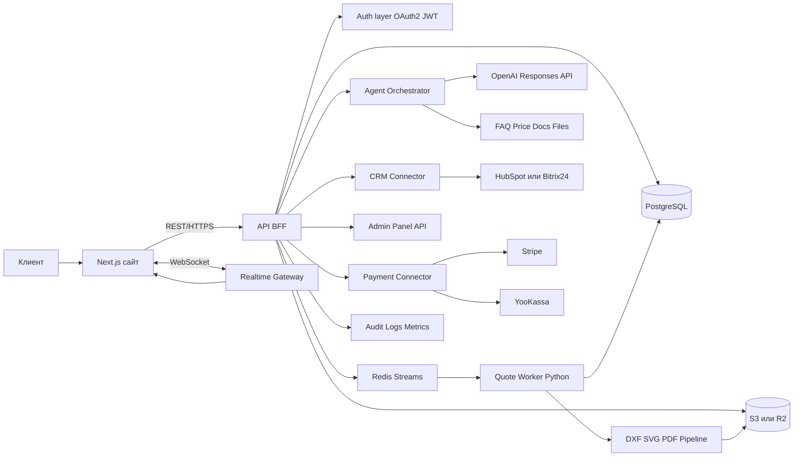
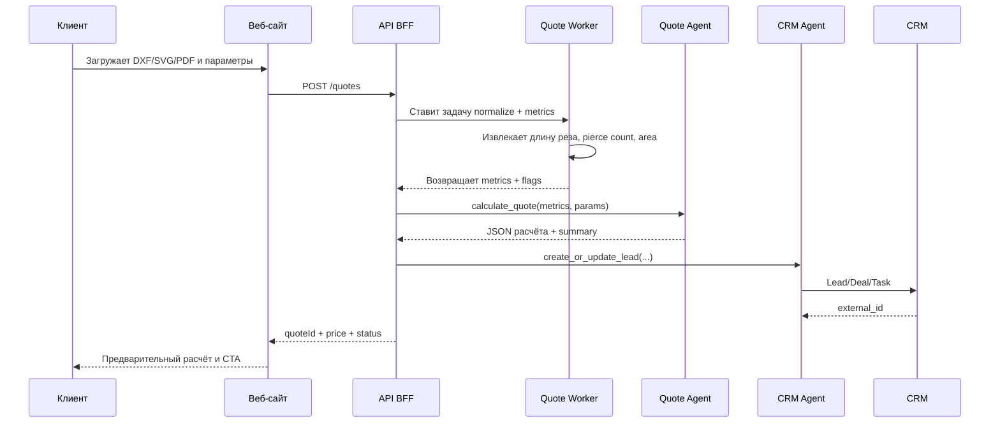

# Создание современного сайта для центра лазерной резки с агентной архитектурой и skill-пакетом для Clod и Codex

## Исполнительное резюме

Для сайта центра лазерной резки без заданных технологических ограничений оптимальна **гибридная архитектура**: SEO-ориентированный фронтенд на Next.js, серверный API/BFF для заказов и кабинета, отдельный воркер для геометрии и расчёта стоимости, PostgreSQL как системная БД, объектное хранилище для чертежей и КП, а для агентной логики — серверная оркестрация через OpenAI Responses API и/или OpenAI Agents SDK. Такой стек хорошо сочетается с адаптивным UI, динамическими метаданными и OG-изображениями, файловыми загрузками, реалтайм-статусами и CI/CD через GitHub Actions. citeturn17view0turn17view1turn16view3turn16view4turn18view3turn17view7

Для **точного автоматического расчёта** лучше считать DXF и SVG первичными форматами, а PDF — форматом предпросмотра и ручной верификации. DXF изначально описывает CAD-сущности вроде `LINE`, `CIRCLE`, `LWPOLYLINE`, `POLYLINE`, `SPLINE`; SVG 2 описывает геометрию路径/контуров и единицы измерения; PDF.js — это общая платформа для разбора и рендеринга PDF, но не CAD-ориентированная модель. Российские и отраслевые калькуляторы лазерной резки обычно опираются на длину реза, количество точек врезки, площадь, материал, толщину листа, тираж и сложность детали. Следовательно, сайт должен выдавать **предварительную цену** и одновременно хранить флаг `manual_review_required` для сложных или неоднозначных файлов. Это инженерная рекомендация, основанная на спецификациях форматов и практике публичных калькуляторов. citeturn13view0turn22view0turn22view1turn22view2turn22view3turn21view0turn21view1turn21view2turn21view3turn21view4

Термин **Clod** в исходных данных **не указан** как конкретная платформа. По результатам поиска ближайший официальный стек с понятием skills/plugins — это **Claude / Claude Code**: там есть `SKILL.md`, plugin manifest в `.claude-plugin/plugin.json`, автодискавери skills и plugin-компоненты вроде skills, agents, hooks, MCP servers и monitors. Поэтому practically useful deliverable здесь должен быть двойным: **vendor-neutral контракт** на OpenAPI/JSON manifest и **Claude-compatible bundle** как ближайший официальный аналог. Для Codex, напротив, целесообразно давать кодогенерацию через репозиторный контракт: OpenAPI, фикстуры чертежей, тесты и конкретные промпты на генерацию модулей. citeturn20view0turn16view5turn16view6turn15view1turn24view1turn15view2

## Исходные условия и допущения

Ниже — параметры, которые в запросе **не указаны**, и как их разумно трактовать в архитектурном отчёте.

| Параметр | Статус | Как трактовать в проекте |
|---|---|---|
| Бюджет | **не указано** | Предложить три класса стека: легковесный, корпоративный, serverless |
| Сроки MVP | **не указано** | Проектировать дорожную карту по приоритетам: сайт → калькулятор → агенты → CRM/платежи |
| География клиентов | **не указано** | Подготовить два контура интеграций: глобальный и RU/CIS |
| CRM | **не указано** | Сравнить HubSpot и Bitrix24 |
| Платёжная система | **не указано** | Сравнить Stripe и ЮKassa |
| ERP/1С | **не указано** | Оставить интеграцию как опцию второго этапа |
| Ограничения по стеку | **без конкретных ограничений** | Рекомендовать 3 варианта архитектуры |
| Тарифные коэффициенты станка | **не указано** | Вынести в админ-панель как конфигурацию |
| Юрисдикция по данным | **не указано** | В отчёте дать рамки для РФ и EU |
| Платформа Clod | **не указано** | Дать vendor-neutral manifest и адаптацию под Claude-compatible skill |

Практически сайт должен быть **quote-centric**: главная ценность не просто “рассказать об услугах”, а быстро перевести чертёж в расчёт, заявку и CRM-сделку. Публичные русскоязычные сервисы расчёта резки показывают, что рынок уже привык к сценарию “загрузить DXF/ввести параметры/получить цену или ориентир”, а отраслевые статьи дополнительно подчёркивают влияние материала, толщины, сложности, скорости реза, мощности оборудования и объёма партии на финальную стоимость. citeturn21view0turn21view1turn21view2turn21view3turn21view4

Ключевое допущение этого отчёта: **PDF не должен быть единственным источником точного авторасчёта**, если важна инженерная корректность. У OpenAI PDF как `input_file` может извлекаться в текст и изображения страниц для анализа содержания, а PDF.js отлично подходит для браузерного предпросмотра, но для точной геометрии надёжнее DXF/SVG-поток. Поэтому intake-агент может читать PDF как спецификацию/бриф, а quote-воркер — считать стоимость по DXF/SVG. citeturn16view2turn22view3turn13view0turn22view0turn22view1

Ещё одно важное допущение: публичный калькулятор должен возвращать не “юридически обязательный оффер”, а **“предварительный расчёт”**, пока менеджер или инженер не подтвердит материалы, толщину, срок и технологические ограничения. Такой подход прямо соответствует тому, как публичные калькуляторы лазерной резки формулируют свои результаты: они показывают ориентир, а точную стоимость увязывают со сложностью, тиражом, материалом, толщиной и дополнительными операциями. citeturn21view1turn21view2

## Архитектура сайта и технологический стек

Так как предпочтения по технологиям **не указаны**, разумно предложить три жизнеспособных варианта.

| Вариант | Состав | Когда выбирать | Сильные стороны | Ограничения | Основание |
|---|---|---|---|---|---|
| Легковесный | Next.js + FastAPI + PostgreSQL + Cloudflare R2/S3 + Docker Compose + GitHub Actions | MVP, небольшой поток заявок, 1 команда | Быстрый старт, единый Git-репозиторий, дешёвый запуск, понятный DevOps | Воркеры и realtime потребуют аккуратной ручной сборки | citeturn17view0turn18view10turn18view3turn18view1turn17view8turn17view7 |
| Корпоративный | Next.js + NestJS + PostgreSQL + Redis Streams + S3 + WebSocket + gRPC для внутренних сервисов | Несколько типов агентных сервисов, стабильный поток B2B-заказов, SLA | Чёткие сервисные контракты, типизированный backend, хорошие паттерны для микросервисов и realtime | Выше стоимость владения и больше DevOps-слоя | citeturn17view0turn18view7turn18view8turn18view9turn19view4turn19view5turn19view0turn19view1turn18view0 |
| Serverless | Next.js on Vercel + Supabase + Supabase Storage/Auth + Cloud Run Jobs для тяжёлых расчётов | Быстрый глобальный деплой, команда без сильного ops-ресурса | Нулеконфиг деплой фронта, preview URLs, встроенный Postgres/Auth/Storage, гибкие batch jobs | Нужно отдельно продумать хранение файловых объектов и лимиты фоновых задач | citeturn28view2turn28view3turn18view4turn18view5turn18view6turn28view0turn28view1 |

Если выбирать **один базовый вариант без дополнительных вводных**, я бы рекомендовал **гибрид**: Next.js на фронте, NestJS как API/BFF, Python-воркер для геометрии и калькулятора, PostgreSQL как master-данные, Redis Streams для событийного контура, Cloudflare R2 или Amazon S3 для файлов. Это даёт хороший баланс между SEO, скоростью разработки, real-time каналами и контролем над инженерной логикой сайта. R2 особенно интересен, если на сайте будет много исходников, PDF-коммерческих предложений и публичных медиа: он S3-совместим, strongly consistent и не взимает egress fee, но его S3-совместимость частичная, поэтому некоторые AWS-специфичные возможности нужно проверять отдельно. S3, со своей стороны, тоже strongly consistent и поддерживает versioning для восстановления случайно удалённых или перезаписанных объектов. citeturn18view1turn18view2turn18view0

Для интеграционного слоя лучше разделить протоколы по роли. **REST/HTTPS** — для публичного API и admin-panel. **WebSocket** — для стека “калькулятор считает → пользователь видит прогресс → чат-бот отвечает в реальном времени”; NestJS даёт стандартные gateway abstractions, а Socket.IO поверх WebSocket добавляет reconnection, acknowledgements, rooms и работу в multi-node сценариях через Redis adapter. **gRPC** стоит использовать только для внутренних высоконагруженных или строго типизированных сервисов, где важны protobuf-IDL и RPC life cycle. Для order-critical event bus надёжнее **Redis Streams**, а не Redis Pub/Sub: у Pub/Sub семантика at-most-once и сообщение при сбое может быть потеряно, тогда как Streams — это persisted append-only log с consumer groups. citeturn18view9turn19view2turn19view3turn19view0turn19view1turn19view4turn19view5

Интеграции лучше проектировать как заменяемые коннекторы, потому что CRM и платёжный провайдер в исходных данных **не указаны**.

| Область | Вариант | Когда подходит | Важная оговорка | Основание |
|---|---|---|---|---|
| CRM | HubSpot | Если нужна современная CRM-объектная модель, app-level OAuth и webhooks | Требуются secure HTTPS endpoint и корректные scopes | citeturn20view8turn20view4 |
| CRM | Bitrix24 | Если бизнес уже живёт в Bitrix24/RU-процессах | У webhook events нет ретраев, а массовые изменения дают burst-нагрузку; значит, обязательны idempotency и очередь | citeturn5search1turn20view5 |
| Платежи | Stripe Checkout | Если работаете глобально и нужен быстрый hosted checkout | Проверка webhook signatures требует raw body и `Stripe-Signature` | citeturn20view6turn20view3 |
| Платежи | ЮKassa | Если целевой рынок РФ/СНГ | Провайдер не указан, поэтому поддержка делается как адаптер | citeturn20view7 |
| Файлы | Amazon S3 | Если важны зрелый IAM-контур и versioning | Выше egress-cost sensitivity | citeturn18view0 |
| Файлы | Cloudflare R2 | Если много скачиваний и CDN-близость важнее AWS-native функций | Частичная реализация S3 API — нужно тестировать фичи | citeturn18view1turn18view2 |
| Файлы | Supabase Storage | Если нужен serverless-стек с RLS и resumable uploads | Backups БД не включают сами объекты storage | citeturn18view5turn18view6 |

Диаграмма ниже — сводная целевая архитектура сайта и интеграций, синтезированная из официальных возможностей выбранных платформ. citeturn17view0turn18view7turn18view9turn18view3turn18view0turn18view1turn16view4



## Архитектура агентов

Для этого проекта агенты разумно строить **не как “умный чат на фронте”**, а как **серверный оркестратор**, который владеет состоянием, инструментами, approvals и CRM-побочными эффектами. Это ровно тот сценарий, для которого OpenAI рекомендует Responses API и Agents SDK: функция tool calling связывает модель с вашими внешними системами, Structured Outputs удерживают JSON-контракты, а Agents SDK уместен, когда именно приложение владеет оркестрацией, state и tool execution. Кроме того, Responses API сейчас объявлен будущим направлением для agent-like приложений, а Assistants API уже находится на траектории sunset. citeturn16view0turn16view1turn16view3turn16view4

Ниже — практическая спецификация агентов для центра лазерной резки.

| Агент | Роль | Вход | Выход | Триггеры | Хранение контекста |
|---|---|---|---|---|---|
| Контент-агент | Генерирует SEO-тексты, карточки услуг, кейсы портфолио, FAQ-ответы | Бриф, список услуг, кейсы, прайс-правила | Черновики страниц, meta title/description, FAQ-блоки | Новый кейс, изменение прайса, публикация новости | PostgreSQL JSONB + CMS draft state |
| Калькулятор-агент | Превращает параметры и нормализованную геометрию в понятный расчёт | `material`, `thickness`, `quantity`, `metrics` | Структурированный quote JSON + human summary | Загрузка DXF/SVG/PDF, ручной ввод параметров | PostgreSQL JSONB, объект в storage, temp cache в Redis |
| Intake-агент | Проверяет полноту заявки, валидирует файл, классифицирует тип запроса | Форма заказа, файл, комментарий клиента | `accepted/review/reject`, reason codes, список недостающих полей | `POST /quotes`, `POST /orders` | PostgreSQL order draft |
| Support-агент | Отвечает по статусу, материалам, срокам, подготовке макета | FAQ, CRM status, price tables, order status | Ответ в чате, escalations, follow-up tasks | Чат, email, WhatsApp/Telegram connector — **не указано** | Краткий session state + order state |
| Агент обработки заявок | Создаёт/обновляет лид, КП, задачи менеджеру, привязку к CRM | Quote JSON, customer profile, file metadata | CRM lead/deal/task, коммерческое предложение | Quote approved, payment initiated, manual review required | БД + CRM external ID |
| Мониторинг-агент | Обнаруживает сбои интеграций, burst-и событий, аномалии конверсии | Логи, metrics, queues, webhook failures | Алёрты, ежедневные summary, remediation tasks | Cron, threshold breach, failed webhook | Observability store + audit log |

Контракты между агентами лучше унифицировать через **JSON envelope**. Это не только упрощает трассировку, но и позволяет независимо масштабировать парсер, калькулятор и CRM-интегратор.

```json
{
  "event": "quote.requested",
  "trace_id": "trc_01JXYZ...",
  "quote_id": "q_2026_000123",
  "tenant_id": "default",
  "customer": {
    "name": "Иван Петров",
    "company": "ООО Пример",
    "email": "info@example.com"
  },
  "file": {
    "key": "uploads/2026/06/part-17.dxf",
    "format": "dxf",
    "sha256": "..."
  },
  "params": {
    "material": "steel",
    "thickness_mm": 3,
    "quantity": 20
  },
  "state": {
    "manual_review_required": false,
    "confidence": "high"
  },
  "ts": "2026-06-01T18:42:11Z"
}
```

С точки зрения коммуникации и масштабирования архитектура должна быть такой. Пользовательский запрос идёт синхронно по REST и быстро получает `202 Accepted` либо моментальный расчёт, если файл простой и всё укладывается в жесткий лимит обработки. Дальше тяжёлый pipeline уходит в очередь/worker. Real-time прогресс и чат-ответы идут через WebSocket. Сервисные вызовы между воркерами можно оставить REST-first; gRPC есть смысл вводить только когда появится несколько интенсивно общающихся внутренних сервисов с жёсткими typed contracts. Контекст сессии и бизнес-объектов удобно хранить в PostgreSQL JSONB, потому что он поддерживает JSON/JSONB и индексацию `jsonb`; для файлов правильнее использовать объектное хранилище; для событийного контура — Redis Streams, а не Pub/Sub. citeturn18view3turn18view0turn18view1turn19view4turn19view5turn19view0turn19view1turn18view9

Безопасность агентного слоя должна быть более строгой, чем у обычного “чат-бота на сайте”. Внешние интеграции — через OAuth 2.0 там, где провайдер это поддерживает; веб-сессии и service-to-service токены — через JWT с коротким TTL; webhooks — c обязательной проверкой подписи; файловые загрузки — через allowlist расширений, sniffing сигнатур, random filenames, отдельное хранилище вне webroot и антивирусный/песочничный контроль. Отдельно стоит предусмотреть idempotency keys для CRM и платёжных вебхуков, потому что часть провайдеров может присылать повторы, а часть — наоборот, не делать ретраи вообще. citeturn20view1turn20view2turn20view3turn25view0turn25view1turn25view2turn25view3turn20view5

Поток расчёта и обработки заявки может выглядеть так. Диаграмма — проектная рекомендация, основанная на перечисленных протоколах и сервисных ролях. citeturn18view9turn19view4turn16view0turn16view1



## Skill для Clod и совместимый пакет для Claude

Вводное замечание принципиально важно: **Clod как конкретная платформа в исходных данных не указана**. В открытых официальных источниках по поиску “Clod skill/plugin” я не нашёл общепринятой спецификации, зато нашёл официальный стек **Claude Skills / Claude Code Plugins / Claude Agent Skills**. У Claude Code skill — это `SKILL.md`, skill загружается по требованию, может вызываться вручную как `/skill-name` или автоматически, а plugin-пакет может включать skills, agents, hooks, MCP servers и monitors. Поэтому ниже я предлагаю **совместимую двухслойную модель**: универсальный manifest на OpenAPI/JSON и Claude-compatible упаковку как наиболее близкий официальный вариант. Это именно интерпретация “Clod” как “возможно, Claude”; она не является подтверждённой спецификацией исходной платформы. citeturn15view1turn24view1turn15view2turn14search4turn14search15

Если ориентироваться на **Claude-compatible** реализацию, то проектный bundle можно оформить так:

```text
laser-center-skill-bundle/
├── .claude-plugin/
│   └── plugin.json
├── skills/
│   ├── laser-quote/
│   │   ├── SKILL.md
│   │   └── pricing-rules.md
│   ├── support-reply/
│   │   └── SKILL.md
│   └── seo-publisher/
│       └── SKILL.md
├── agents/
│   ├── quote-reviewer.md
│   ├── crm-sync.md
│   └── content-editor.md
├── hooks/
│   └── hooks.json
├── .mcp.json
└── scripts/
    ├── quote_webhook.py
    └── publish_case_study.js
```

Claude Code различает project-level skills, personal skills, plugin skills и namespaced plugin commands. Команда для вызова skill обычно определяется **местом хранения**, а не только полем `name`: например, `.claude/skills/deploy-staging/SKILL.md` создаёт `/deploy-staging`, а plugin skill в `skills/review/SKILL.md` будет namespaced как `/my-plugin:review`. Это удобно для команд типа `/laser-center:laser-quote` или `/laser-center:support-reply`. citeturn23view0turn23view1turn23view2

Минимальный **Claude-compatible manifest** для plugin-режима может выглядеть так:

```json
{
  "name": "laser-center-suite",
  "version": "0.1.0",
  "description": "Skills, agents and hooks for laser cutting quotes, CRM sync and support flows.",
  "author": {
    "name": "Your Company"
  }
}
```

Для vendor-neutral совместимости лучше иметь ещё и **OpenAPI 3.1**-контракт. OpenAPI описывает HTTP API так, чтобы его могли понять и люди, и программы, без доступа к исходному коду. Это полезно сразу в трёх местах: для самого skill/плагина, для внутреннего BFF и для Codex, который потом генерирует клиентские и серверные модули поверх спецификации. citeturn20view0

```yaml
openapi: 3.1.0
info:
  title: Laser Center Agent API
  version: 0.1.0
servers:
  - url: https://api.example.com
paths:
  /quotes:
    post:
      operationId: createQuote
      summary: Create a preliminary quote from a drawing and parameters
      requestBody:
        required: true
        content:
          application/json:
            schema:
              $ref: '#/components/schemas/CreateQuoteRequest'
      responses:
        '202':
          description: Accepted for async processing
        '200':
          description: Immediate quote
  /files/normalize:
    post:
      operationId: normalizeDrawing
      summary: Extract geometry metrics from DXF, SVG, or PDF
  /crm/leads:
    post:
      operationId: createLead
      summary: Create or update CRM lead/deal
components:
  schemas:
    CreateQuoteRequest:
      type: object
      additionalProperties: false
      required:
        - customer
        - file
        - material
        - thicknessMm
        - quantity
      properties:
        customer:
          type: object
          required: [name, email]
          additionalProperties: false
          properties:
            name: { type: string }
            email: { type: string, format: email }
            company: { type: string }
        file:
          type: object
          required: [storageKey, format]
          additionalProperties: false
          properties:
            storageKey: { type: string }
            format: { type: string, enum: [dxf, svg, pdf] }
        material: { type: string }
        thicknessMm: { type: number }
        quantity: { type: integer, minimum: 1 }
```

Набор команд и интентов для такого skill-пакета я бы определил так:

| Команда или интент | Назначение | Доступ | Пример |
|---|---|---|---|
| `/laser-center:laser-quote` | Запустить intake + нормализацию + расчёт | Менеджер, инженер, клиентский сценарий через API | “Посчитай `panel.dxf`, steel, 3 мм, 20 шт.” |
| `/laser-center:support-reply` | Сформировать ответ в чат, email или мессенджер | Поддержка | “Где мой заказ Q-1021?” |
| `/laser-center:seo-publisher` | Сгенерировать и подготовить кейс/FAQ/обновление прайса | Контент-редактор | “Сделай кейс по резке нержавейки 2 мм” |
| `createQuote` | HTTP интент для сайта | Публичный/API | POST `/quotes` |
| `normalizeDrawing` | Технический инструмент skill-а и Codex-клиента | Внутренний | POST `/files/normalize` |
| `createLead` | CRM side effect | Внутренний | POST `/crm/leads` |

Пример диалога для skill-а:

> Пользователь: `/laser-center:laser-quote file=door-bracket.dxf material=steel thickness=4 quantity=50`  
> Skill: проверяет формат, получает длину реза и врезки, считает предварительную сумму, возвращает структурированный JSON, краткий русский summary и, при необходимости, ставит флаг ручной проверки.

> Пользователь: `/laser-center:support-reply order=Q-000431`  
> Skill: подтягивает статус заказа, проверяет CRM, формирует человеческий ответ и предлагает CTA “Подтвердить оплату” или “Уточнить материал”.

С точки зрения прав доступа лучше разделить scopes примерно так: `quote:read`, `quote:write`, `crm:lead.write`, `crm:deal.write`, `storage:file.read`, `storage:file.write`, `admin:pricing.write`, `content:publish`. Для Claude-compatible skill-ов можно дополнительно использовать frontmatter-поля вроде `disable-model-invocation` и `allowed-tools`, чтобы ограничить автоматический вызов и заранее согласовать допустимые инструменты. Это особенно полезно для skill-ов, которые могут создавать сделки, публиковать контент или запускать деплой. При этом важно помнить, что **Claude Agent Skills не подходят под Zero Data Retention**, поэтому если “Clod” действительно окажется Claude API/Claude Skills, то любые персональные данные и CAD-файлы нужно либо минимизировать/анонимизировать, либо сначала согласовать этот контур с legal/compliance. citeturn23view0turn23view1turn23view3turn24view0turn15view2

С точки зрения деплоя для Claude-compatible пути есть два. Первый — просто хранить project-level skill в `.claude/skills/<skill-name>/SKILL.md`, и он будет виден только в этом репозитории. Второй — оформлять plugin и ставить его в `user`, `project` или `local` scope через `claude plugin install ... --scope project`, если вы распространяете skill через marketplace или внутренний каталог. citeturn23view0turn24view0

## Примеры реализации для Codex

Codex имеет смысл использовать здесь не как “магический генератор всего проекта”, а как **кодового агента, который получает жёсткий контракт**: OpenAPI-спецификацию, fixtures файлов DXF/SVG/PDF, схему quote JSON, тесты и критерии приёмки. По официальному описанию Codex умеет писать код, понимать существующие codebase, делать code review, отлаживать проблемы и автоматизировать рутинные инженерные задачи; Codex CLI можно запускать локально, и он умеет читать, менять и выполнять код в выбранной директории. citeturn16view5turn16view6

Чтобы Codex стабильно генерировал рабочие модули, я бы закладывал в репозиторий такой “пакет контекста”:

- `openapi/laser-center.yaml`
- `docs/requirements.md`
- `fixtures/dxf/*.dxf`
- `fixtures/svg/*.svg`
- `fixtures/pdf/*.pdf`
- `tests/quote/*.spec.ts` и `tests/quote/*.py`
- `pricing/material-rates.json`

Ниже — примеры файлов, которые Codex можно попросить создать или доработать. Они намеренно написаны как **production-oriented skeletons**, а не как псевдокод.

**Файл `apps/api/src/agents/quote-orchestrator.ts`**

```ts
import OpenAI from "openai";

type NormalizeArgs = {
  storageKey: string;
  format: "dxf" | "svg" | "pdf";
  material: string;
  thicknessMm: number;
  quantity: number;
};

type QuoteArgs = {
  metrics: {
    cutLengthMm: number;
    areaMm2: number;
    pierceCount: number;
    closedContours: number;
    exactGeometry: boolean;
    manualReviewRequired: boolean;
  };
  material: string;
  thicknessMm: number;
  quantity: number;
};

type LeadArgs = {
  customer: {
    name: string;
    email: string;
    company?: string;
    phone?: string;
  };
  quoteSummary: string;
  quoteId: string;
};

const openai = new OpenAI({
  apiKey: process.env.OPENAI_API_KEY,
});

const MODEL = process.env.OPENAI_MODEL ?? "gpt-5.5";
const INTERNAL_PRICING_URL = process.env.INTERNAL_PRICING_URL ?? "http://pricing:8000";

async function normalizeDrawing(args: NormalizeArgs) {
  const res = await fetch(`${INTERNAL_PRICING_URL}/normalize`, {
    method: "POST",
    headers: { "content-type": "application/json" },
    body: JSON.stringify(args),
  });

  if (!res.ok) {
    throw new Error(`normalize failed: ${res.status} ${await res.text()}`);
  }

  return await res.json();
}

async function calculateQuote(args: QuoteArgs) {
  const res = await fetch(`${INTERNAL_PRICING_URL}/quote`, {
    method: "POST",
    headers: { "content-type": "application/json" },
    body: JSON.stringify(args),
  });

  if (!res.ok) {
    throw new Error(`quote failed: ${res.status} ${await res.text()}`);
  }

  return await res.json();
}

async function createCrmLead(args: LeadArgs) {
  // Замените this stub на HubSpot/Bitrix24 adapter.
  return {
    crmProvider: process.env.CRM_PROVIDER ?? "not_configured",
    status: "queued",
    leadExternalId: `lead_${Date.now()}`,
    ...args,
  };
}

export async function buildQuoteConversation(userMessage: string): Promise<string> {
  const tools = [
    {
      type: "function",
      name: "normalize_drawing",
      description: "Extract geometric metrics from DXF, SVG, or PDF and return normalized values.",
      strict: true,
      parameters: {
        type: "object",
        additionalProperties: false,
        required: ["storageKey", "format", "material", "thicknessMm", "quantity"],
        properties: {
          storageKey: { type: "string" },
          format: { type: "string", enum: ["dxf", "svg", "pdf"] },
          material: { type: "string" },
          thicknessMm: { type: "number" },
          quantity: { type: "integer", minimum: 1 }
        }
      }
    },
    {
      type: "function",
      name: "calculate_quote",
      description: "Calculate preliminary quote from normalized geometric metrics.",
      strict: true,
      parameters: {
        type: "object",
        additionalProperties: false,
        required: ["metrics", "material", "thicknessMm", "quantity"],
        properties: {
          metrics: {
            type: "object",
            additionalProperties: false,
            required: [
              "cutLengthMm",
              "areaMm2",
              "pierceCount",
              "closedContours",
              "exactGeometry",
              "manualReviewRequired"
            ],
            properties: {
              cutLengthMm: { type: "number" },
              areaMm2: { type: "number" },
              pierceCount: { type: "integer" },
              closedContours: { type: "integer" },
              exactGeometry: { type: "boolean" },
              manualReviewRequired: { type: "boolean" }
            }
          },
          material: { type: "string" },
          thicknessMm: { type: "number" },
          quantity: { type: "integer", minimum: 1 }
        }
      }
    },
    {
      type: "function",
      name: "create_crm_lead",
      description: "Create or update a CRM lead after quote calculation.",
      strict: true,
      parameters: {
        type: "object",
        additionalProperties: false,
        required: ["customer", "quoteSummary", "quoteId"],
        properties: {
          customer: {
            type: "object",
            additionalProperties: false,
            required: ["name", "email"],
            properties: {
              name: { type: "string" },
              email: { type: "string" },
              company: { type: "string" },
              phone: { type: "string" }
            }
          },
          quoteSummary: { type: "string" },
          quoteId: { type: "string" }
        }
      }
    }
  ] as const;

  let input: Array<Record<string, unknown>> = [
    {
      role: "user",
      content: userMessage
    }
  ];

  let response = await openai.responses.create({
    model: MODEL,
    tools,
    input,
    instructions:
      "Ты серверный оркестратор центра лазерной резки. " +
      "Работай только на русском. " +
      "Если файловых данных или параметров недостаточно, запрашивай только критически важные поля. " +
      "Если формат PDF или geometry ambiguous, сохрани manual review. " +
      "Не выдумывай стоимость — используй только ответы инструментов."
  });

  for (let hop = 0; hop < 4; hop++) {
    const toolOutputs: Array<{
      type: "function_call_output";
      call_id: string;
      output: string;
    }> = [];

    for (const item of response.output ?? []) {
      if (item.type !== "function_call") continue;

      const args = JSON.parse(item.arguments);
      let result: unknown;

      switch (item.name) {
        case "normalize_drawing":
          result = await normalizeDrawing(args as NormalizeArgs);
          break;
        case "calculate_quote":
          result = await calculateQuote(args as QuoteArgs);
          break;
        case "create_crm_lead":
          result = await createCrmLead(args as LeadArgs);
          break;
        default:
          throw new Error(`Unknown tool: ${item.name}`);
      }

      toolOutputs.push({
        type: "function_call_output",
        call_id: item.call_id,
        output: JSON.stringify(result)
      });
    }

    if (!toolOutputs.length) {
      return response.output_text;
    }

    input = [...input, ...toolOutputs];

    response = await openai.responses.create({
      model: MODEL,
      tools,
      input,
      instructions:
        "Верни краткий ответ для UI. " +
        "Структура ответа: quoteId, price, currency, confidence, manualReviewRequired, nextAction, summary."
    });
  }

  throw new Error("Tool-call loop exceeded maximum hops.");
}
```

Этот модуль опирается на официальный паттерн OpenAI function calling: tools с JSON Schema, исполнение внешних функций на вашей стороне и передача результатов обратно через `function_call_output`. Для строгих схем имеет смысл включать `strict: true` и `additionalProperties: false`. citeturn16view0turn29view0turn29view3

**Файл `services/pricing/pricing_service.py`**

```python
from __future__ import annotations

from dataclasses import asdict, dataclass
from math import dist, pi
from pathlib import Path
from typing import Literal

from fastapi import FastAPI, HTTPException
from pydantic import BaseModel


@dataclass
class GeometryMetrics:
    source_format: Literal["dxf", "svg", "pdf"]
    cut_length_mm: float
    area_mm2: float
    pierce_count: int
    closed_contours: int
    exact_geometry: bool
    manual_review_required: bool
    notes: list[str]


@dataclass
class PricingConfig:
    setup_fee: float
    cut_rate_per_mm: float
    pierce_rate: float
    material_rate_per_mm2: float
    complexity_markup: float
    min_order_total: float


class NormalizeRequest(BaseModel):
    storageKey: str
    format: Literal["dxf", "svg", "pdf"]
    material: str
    thicknessMm: float
    quantity: int


class QuoteRequest(BaseModel):
    metrics: dict
    material: str
    thicknessMm: float
    quantity: int


app = FastAPI(title="Laser Center Pricing Service")


def polygon_area(points: list[tuple[float, float]]) -> float:
    """Shoelace formula. Points must be ordered and define a closed contour."""
    if len(points) < 3:
        return 0.0

    area = 0.0
    for i in range(len(points)):
        x1, y1 = points[i]
        x2, y2 = points[(i + 1) % len(points)]
        area += x1 * y2 - x2 * y1
    return abs(area) / 2.0


def normalize_dxf(path: Path) -> GeometryMetrics:
    """
    Example implementation.
    In production, add more DXF entity types and connectivity analysis for exact pierce counts.
    """
    import ezdxf  # pip install ezdxf

    doc = ezdxf.readfile(path)
    msp = doc.modelspace()

    cut_length = 0.0
    area = 0.0
    pierces = 0
    closed = 0
    notes: list[str] = []
    exact = True
    manual = False

    for entity in msp:
        t = entity.dxftype()

        if t == "LINE":
            start = entity.dxf.start
            end = entity.dxf.end
            cut_length += dist((start.x, start.y), (end.x, end.y))

        elif t == "CIRCLE":
            r = float(entity.dxf.radius)
            cut_length += 2 * pi * r
            area += pi * r * r
            pierces += 1
            closed += 1

        elif t == "ARC":
            start_angle = float(entity.dxf.start_angle)
            end_angle = float(entity.dxf.end_angle)
            sweep = (end_angle - start_angle) % 360.0
            r = float(entity.dxf.radius)
            cut_length += 2 * pi * r * (sweep / 360.0)
            # Area of open arcs is intentionally not counted into stock area.

        elif t == "LWPOLYLINE":
            pts = [(float(p[0]), float(p[1])) for p in entity.get_points("xy")]
            if len(pts) < 2:
                continue

            for i in range(len(pts) - 1):
                cut_length += dist(pts[i], pts[i + 1])

            is_closed = bool(entity.closed)
            if is_closed:
                cut_length += dist(pts[-1], pts[0])
                area += polygon_area(pts)
                pierces += 1
                closed += 1

        elif t == "POLYLINE":
            pts = [
                (float(v.dxf.location.x), float(v.dxf.location.y))
                for v in entity.vertices
            ]
            if len(pts) < 2:
                continue

            for i in range(len(pts) - 1):
                cut_length += dist(pts[i], pts[i + 1])

            is_closed = bool(entity.is_closed)
            if is_closed:
                cut_length += dist(pts[-1], pts[0])
                area += polygon_area(pts)
                pierces += 1
                closed += 1

        else:
            exact = False
            manual = True
            notes.append(f"Unsupported DXF entity for exact auto-quote: {t}")

    return GeometryMetrics(
        source_format="dxf",
        cut_length_mm=round(cut_length, 3),
        area_mm2=round(area, 3),
        pierce_count=pierces,
        closed_contours=closed,
        exact_geometry=exact,
        manual_review_required=manual,
        notes=notes,
    )


def normalize_svg(path: Path) -> GeometryMetrics:
    """
    Example implementation using community library.
    """
    from svgpathtools import svg2paths2  # pip install svgpathtools

    paths, _attrs, _svg_attrs = svg2paths2(str(path))

    cut_length = 0.0
    area = 0.0
    closed = 0
    pierces = 0
    notes: list[str] = []

    for p in paths:
        cut_length += float(p.length(error=1e-4))
        if p.isclosed():
            closed += 1
            pierces += 1
            try:
                area += abs(float(p.area()))
            except Exception:
                notes.append("SVG path area could not be computed; set to 0 for this contour.")

    return GeometryMetrics(
        source_format="svg",
        cut_length_mm=round(cut_length, 3),
        area_mm2=round(area, 3),
        pierce_count=pierces,
        closed_contours=closed,
        exact_geometry=True,
        manual_review_required=False,
        notes=notes,
    )


def normalize_pdf(path: Path) -> GeometryMetrics:
    """
    Conservative strategy:
    PDF is accepted, previewed and stored, but exact geometry is marked for manual review.
    """
    from pypdf import PdfReader  # pip install pypdf

    reader = PdfReader(str(path))
    page_count = len(reader.pages)

    return GeometryMetrics(
        source_format="pdf",
        cut_length_mm=0.0,
        area_mm2=0.0,
        pierce_count=0,
        closed_contours=0,
        exact_geometry=False,
        manual_review_required=True,
        notes=[f"PDF uploaded with {page_count} pages; require engineer/manual review."],
    )


def load_metrics(path: Path, fmt: str) -> GeometryMetrics:
    if fmt == "dxf":
        return normalize_dxf(path)
    if fmt == "svg":
        return normalize_svg(path)
    if fmt == "pdf":
        return normalize_pdf(path)
    raise ValueError(f"Unsupported format: {fmt}")


def pick_pricing_config(material: str, thickness_mm: float) -> PricingConfig:
    """
    Replace with DB lookup from admin-managed price tables.
    """
    base_cut = 0.035
    base_material = 0.00012

    multiplier = 1.0 + max(0.0, thickness_mm - 1.0) * 0.10

    return PricingConfig(
        setup_fee=12.0,
        cut_rate_per_mm=base_cut * multiplier,
        pierce_rate=0.18 * multiplier,
        material_rate_per_mm2=base_material * multiplier,
        complexity_markup=0.08 if thickness_mm >= 6 else 0.03,
        min_order_total=25.0,
    )


def calculate_quote(metrics: GeometryMetrics, material: str, thickness_mm: float, quantity: int) -> dict:
    cfg = pick_pricing_config(material, thickness_mm)

    machine_cost_per_part = (
        metrics.cut_length_mm * cfg.cut_rate_per_mm +
        metrics.pierce_count * cfg.pierce_rate
    )
    material_cost_per_part = metrics.area_mm2 * cfg.material_rate_per_mm2

    subtotal = cfg.setup_fee + (machine_cost_per_part + material_cost_per_part) * quantity
    subtotal *= (1.0 + cfg.complexity_markup)

    # Simple volume discount example.
    if quantity >= 100:
        subtotal *= 0.93
    elif quantity >= 30:
        subtotal *= 0.97

    total = max(subtotal, cfg.min_order_total)

    return {
        "price": round(total, 2),
        "currency": "USD",
        "confidence": (
            "high" if metrics.exact_geometry and not metrics.manual_review_required else "low"
        ),
        "manualReviewRequired": metrics.manual_review_required,
        "breakdown": {
            "setupFee": round(cfg.setup_fee, 2),
            "machineCostPerPart": round(machine_cost_per_part, 4),
            "materialCostPerPart": round(material_cost_per_part, 4),
            "quantity": quantity,
            "complexityMarkup": cfg.complexity_markup,
        },
        "notes": metrics.notes,
    }


@app.post("/normalize")
def normalize(req: NormalizeRequest):
    path = Path(req.storageKey)
    if not path.exists():
        raise HTTPException(status_code=404, detail=f"File not found: {req.storageKey}")

    metrics = load_metrics(path, req.format)
    return asdict(metrics)


@app.post("/quote")
def quote(req: QuoteRequest):
    metrics = GeometryMetrics(
        source_format="dxf",
        cut_length_mm=float(req.metrics["cutLengthMm"]),
        area_mm2=float(req.metrics["areaMm2"]),
        pierce_count=int(req.metrics["pierceCount"]),
        closed_contours=int(req.metrics["closedContours"]),
        exact_geometry=bool(req.metrics["exactGeometry"]),
        manual_review_required=bool(req.metrics["manualReviewRequired"]),
        notes=[],
    )
    return calculate_quote(metrics, req.material, req.thicknessMm, req.quantity)
```

Этот Python-сервис intentionally консервативен: PDF принимается и хранится, но помечается как `manual_review_required`; точные auto-quotes делаются по DXF/SVG. Архитектурно это согласуется и со спецификациями форматов, и с практикой онлайн-калькуляторов лазерной резки. citeturn13view0turn22view0turn22view1turn21view0turn21view3

**Файл `apps/api/src/webhooks/stripe.ts`**

```ts
import express from "express";
import Stripe from "stripe";

const stripe = new Stripe(process.env.STRIPE_SECRET_KEY!, {});

export const stripeWebhookRouter = express.Router();

// ВАЖНО: Stripe требует raw body для проверки подписи.
// Поэтому этот router должен монтироваться раньше JSON body parser
// или на отдельный путь с express.raw().
stripeWebhookRouter.post(
  "/stripe",
  express.raw({ type: "application/json" }),
  async (req, res) => {
    const signature = req.header("stripe-signature");
    if (!signature) {
      return res.status(400).send("Missing Stripe-Signature header");
    }

    let event: Stripe.Event;

    try {
      event = stripe.webhooks.constructEvent(
        req.body,
        signature,
        process.env.STRIPE_WEBHOOK_SECRET!
      );
    } catch (err) {
      const message = err instanceof Error ? err.message : "Unknown signature error";
      return res.status(400).send(`Invalid signature: ${message}`);
    }

    switch (event.type) {
      case "checkout.session.completed": {
        const session = event.data.object as Stripe.Checkout.Session;
        // TODO:
        // 1) Найти quote/order по session.id или metadata.quoteId
        // 2) Пометить оплату как received
        // 3) Поставить задачу агенту CRM sync
        console.log("Checkout completed", session.id);
        break;
      }

      default:
        console.log("Unhandled Stripe event:", event.type);
    }

    return res.sendStatus(200);
  }
);
```

Stripe официально рекомендует верифицировать webhook signatures через свои библиотеки, используя `Stripe-Signature`, endpoint secret и **raw body** запроса; без raw body проверка подписи ломается. Для HubSpot и Bitrix24 здесь остаётся тот же каркас: быстрый acknowledge, idempotency и передача side effects в очередь. citeturn20view3turn20view4turn20view5

**Файл `tests/test_pricing.py`**

```python
from services.pricing.pricing_service import GeometryMetrics, calculate_quote


def test_min_order_floor():
    metrics = GeometryMetrics(
        source_format="dxf",
        cut_length_mm=10.0,
        area_mm2=100.0,
        pierce_count=1,
        closed_contours=1,
        exact_geometry=True,
        manual_review_required=False,
        notes=[],
    )

    result = calculate_quote(metrics, material="steel", thickness_mm=1.0, quantity=1)
    assert result["price"] >= 25.0


def test_manual_review_lowers_confidence():
    metrics = GeometryMetrics(
        source_format="pdf",
        cut_length_mm=0.0,
        area_mm2=0.0,
        pierce_count=0,
        closed_contours=0,
        exact_geometry=False,
        manual_review_required=True,
        notes=["PDF uploaded"],
    )

    result = calculate_quote(metrics, material="steel", thickness_mm=2.0, quantity=10)
    assert result["manualReviewRequired"] is True
    assert result["confidence"] == "low"
```

Практическая инструкция для работы с Codex здесь такая. Сначала отдавайте ему **контракт**, потом — **один модуль**, потом — **тесты**, и лишь затем просите рефакторинг. Это намного стабильнее, чем один огромный промпт “сделай весь сайт”. Хорошие примеры задач для Codex:

- “Прочитай `openapi/laser-center.yaml` и сгенерируй NestJS controller + DTO + Zod validation для `/quotes`.”
- “Добавь unit tests для `calculate_quote`, покрыв min order, quantity discount и manual review.”
- “Реализуй upload pipeline для DXF/SVG/PDF: allowlist расширений, UUID filenames, private storage key, virus scan hook.”

Такой режим хорошо соответствует официальным сценариям Codex: локальный CLI, работа по каталогу проекта, автоматизация повторяемых инженерных задач и использование subagents/MCP там, где проект действительно вырос. citeturn16view5turn16view6

## UX SEO безопасность и деплой

Сайт для центра лазерной резки должен быть спроектирован вокруг короткого пути “**от чертежа к заявке**”. Рекомендуемая структура страниц такая.

| Страница | Что должно быть | Основной CTA | Комментарий |
|---|---|---|---|
| Главная | УТП, материалы, сроки, примеры работ, преимущества, FAQ | **Загрузить чертёж и получить расчёт** | Главная цель — отправить в калькулятор |
| Услуги | Лазерная резка, гибка, гравировка, покраска — если есть; неуказанные услуги пометить как **не указано** | **Рассчитать стоимость** | Каждая услуга — отдельная SEO-страница |
| Материалы и толщины | Таблица материалов, доступные толщины, ограничения | **Уточнить материал по задаче** | Контентный слой для long-tail SEO |
| Калькулятор | Upload DXF/SVG/PDF, материал, толщина, количество, срок | **Получить предварительную цену** | Центр конверсии |
| Портфолио | Кейсы с фильтрами по материалу, толщине, отрасли | **Отправить похожую задачу** | Важно для доверия |
| Прайс-лист | Базовые ставки, минимальный заказ, disclaimer “предварительный расчёт” | **Запросить точный КП** | Не заменяет индивидуальную смету |
| FAQ | Подготовка макета, допустимые форматы, сроки, доставка — если есть; доставка **не указано** | **Задать вопрос в чат** | Уменьшает нагрузку на поддержку |
| Контакты | Телефон, email, карта, реквизиты — если есть | **Связаться с менеджером** | Добавить часы работы и отделы |
| Админ-панель | Материалы, тарифы, заявки, портфолио, агентные логи, CRM sync | — | Только после авторизации |

Пример состава формы заказа: имя, компания, email, телефон, формат файла, файл, материал, толщина, количество, желаемый срок, комментарий, чекбокс согласия на обработку данных. Поле “срочность” полезно, но в исходных данных **не указано**, поэтому его лучше сделать опциональным, а не системообразующим.

Для SEO я рекомендую три слоя. Первый — **Next.js Metadata API** с `metadata` и `generateMetadata` для title/description/canonical/OG. Второй — **JSON-LD**: как минимум `LocalBusiness` для компании, а на карточках услуг и некоторых прайс-экспозициях — аккуратная разметка service/product-like сущностей, только если контент реально виден на странице. Третий — технический слой: автоматическая sitemap, корректный robots/noindex режим и явное закрытие приватных страниц заказов. Google прямо пишет, что structured data помогает понимать контент и получать richer results; для local business она может улучшать отображение в Search и Maps; sitemap лучше генерировать автоматически; а `robots.txt` — не механизм скрытия страниц из поиска, для этого нужен `noindex` или защита доступом. citeturn17view0turn17view1turn17view2turn17view3turn17view4turn17view5

С точки зрения UX тексты CTA лучше держать максимально предметными: **“Загрузить DXF и получить цену”**, **“Проверить чертёж”**, **“Получить точный КП за 15 минут”**, **“Задать вопрос инженеру”**, **“Повторить прошлый заказ”**. Для B2B-конверсии хороши короткие блоки доверия рядом с формой: допустимые форматы, минимальное время ответа, какие материалы режете, что считается автоматически, а что уходит в ручную проверку.

Безопасность и соответствие требованиям здесь критичны из-за двойной чувствительности данных: персональные данные + инженерные файлы. Базовый минимум такой: OAuth 2.0 для внешних приложений и CRM-интеграций, JWT для сессионного/API-контуров, изоляция файлов в private object storage, presigned URLs, проверка webhook signatures, аудиторный лог действий в админке, резервные копии БД и отдельный backup-plan для файлов. Для upload-контура полезна практически вся OWASP File Upload Cheat Sheet: allowlist расширений, недоверие к `Content-Type`, смена имени файла на сгенерированное, лимиты размеров, отдельный host/storage, AV/CDR/песочница и CSRF-защита. Если проект работает с персональными данными в РФ, применимость 152-ФЗ и публикация политики обработки данных нужно проверять отдельно; Роскомнадзор публикует рекомендации по подготовке такого документа. Если проект обслуживает клиентов в ЕС, нужно учитывать рамки GDPR. Юрисдикция, однако, в запросе **не указана**, поэтому эти меры здесь перечислены как обязательный legal review checklist, а не как финальная правовая квалификация. citeturn20view1turn20view2turn20view3turn25view0turn25view1turn25view2turn25view3turn26view1turn11search11turn11search1

План деплоя и CI/CD лучше строить по средам, а не “одним большим bash-скриптом”.

| Этап | Что выполняется | Инструменты | Критично проверить | Основание |
|---|---|---|---|---|
| Pull Request | lint, unit tests, schema validation, type checks | GitHub Actions | DTO/JSON Schema/OpenAPI drift | citeturn17view7 |
| Build | Сборка фронта, backend image, worker image | GitHub Actions + Docker Compose/Docker build | Репрезентативные fixtures DXF/SVG/PDF | citeturn17view7turn17view8 |
| Preview | Preview deployment фронта на каждый PR | Vercel Preview | Форма заказа, metadata, OG, robots | citeturn28view2turn28view3 |
| Staging | Полный e2e путь quote → CRM stub → payment stub | Vercel/Cloud Run/containers | Webhooks, idempotency, queue replay | citeturn28view1turn28view0turn28view3 |
| Production | Frontend deploy + API/worker rollout + migrations | Vercel, managed containers или VPS | Zero-downtime, compatibility migrations | citeturn28view2turn28view3turn17view8 |
| Backup | Снэпшоты БД, object retention/versioning | PostgreSQL backups + S3 versioning/R2 strategy | Storage backup отдельно от DB backup | citeturn18view0turn18view6 |
| Post-deploy | Smoke tests, sitemap check, Search Console, monitor alerts | GitHub Actions + observability | Калькулятор, чат, формы, SEO endpoints | citeturn17view4turn17view7 |

Если выбрать **serverless** путь, то тяжёлую геометрию лучше вынести не в inline function, а в **Cloud Run Job** или отдельный worker-service: Cloud Run docs прямо различают service, который слушает запросы, и job, который выполняет задачу и завершает работу. Если выбрать **VPS/легковесный** путь, то Docker Compose остаётся самым понятным способом описать multi-container приложение для сайта, API, воркера, Redis и Postgres. citeturn28view0turn17view8

**Приоритетные источники для реализации** я бы зафиксировал так, в указанном порядке.  
Официальные OpenAI-источники: Responses API, Function Calling, Structured Outputs, Agents SDK, File Inputs, Codex и Codex CLI. citeturn16view0turn16view1turn16view2turn16view3turn16view5turn16view6  
Официальные web/app-источники: Next.js Metadata API, NestJS file upload/gateways/microservices, FastAPI background tasks, GitHub Actions, Vercel, Cloud Run, Docker Compose. citeturn17view0turn17view1turn18view7turn18view8turn18view9turn18view10turn17view7turn28view2turn28view3turn28view0turn17view8  
Официальные стандарты и форматы: Autodesk DXF Reference, W3C SVG 2, OpenAPI 3.1, OAuth 2.0, JWT. citeturn13view0turn22view0turn22view1turn22view2turn20view0turn20view1turn20view2  
Официальные SEO и security-источники: Google Search Central, Schema.org, OWASP File Upload Cheat Sheet. citeturn17view2turn17view3turn17view4turn17view5turn6search1turn25view0turn25view2  
Официальные интеграции: HubSpot, Bitrix24, Stripe, ЮKassa, S3, R2, Supabase. citeturn20view8turn20view4turn20view5turn20view6turn20view7turn18view0turn18view1turn18view2turn18view5turn18view6  
Русскоязычные ресурсы по практике лазерной резки: LaserNest, CUTL, Nateko, Lasercraft — использовать не как нормативный источник, а как источник понимания рыночных ожиданий к онлайн-калькулятору. citeturn21view0turn21view1turn21view2turn21view3